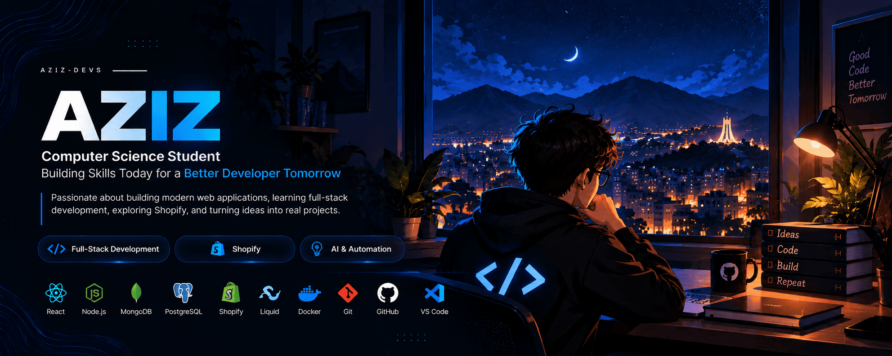

<!-- Header Banner -->

  

# 👋 Hey, I'm Aziz

### Computer Science Student • Aspiring Software Engineer

  I am a Computer Science student passionate about building modern web applications, exploring full-stack development, and creating custom Shopify solutions. Currently focused on strengthening software engineering foundations and turning ideas into clean, functional code.

  <a href="#-about-me">About Me</a> •
  <a href="#-currently-building--learning">Learning Path</a> •
  <a href="#%EF%B8%8F-tech-stack">Tech Stack</a> •
  <a href="#-projects-in-progress">Projects</a> •
  <a href="#-github-stats">Stats</a> •
  <a href="#-connect-with-me">Connect</a>

 

## 👨‍💻 About Me

- 🎓 **Education:** Computer Science Student
- 🎯 **Direction:** Aspiring Software Engineer & Full-Stack Developer
- 💻 **Focus:** Web Development, REST APIs, Shopify Storefronts
- 🛠️ **Status:** Software Engineer in progress — building core technical foundations
- 🌐 **Interests:** Modern Web Systems, System Design, AI & Automation, Cloud Concepts

 

## 🚀 Currently Building & Learning

Here is a concise overview of my active learning focus:

- **Frontend:** HTML5, CSS3, JavaScript, React
- **Backend:** Node.js, Express
- **Databases:** MongoDB, PostgreSQL
- **E-Commerce:** Shopify, Liquid
- **Engineering Fundamentals:** APIs, Authentication, Git version control, System Design
- **Exploring Next:** Docker, Cloud fundamentals, AI tools and workflow automation

 

## 🛠️ Tech Stack

### 🟢 Comfortable With

### 🟡 Currently Learning & Building With

### 🔵 Exploring & Fundamentals

 

## 🚧 Projects in Progress

   
  
<i>Building in progress — projects will be published here soon.</i>

   

## 📊 GitHub Stats

<table border="0">
  <tr>
    <td width="50%" align="center">
      
    </td>
    <td width="50%" align="center">
      
    </td>
  </tr>
</table>

 

 

## 🔥 GitHub Activity

  

 

## 🤝 Connect With Me

  Feel free to reach out if you'd like to discuss web development, e-commerce, or software engineering.

 

---

  Designed for <b>@aziz-devs</b> • Modern GitHub Profile

